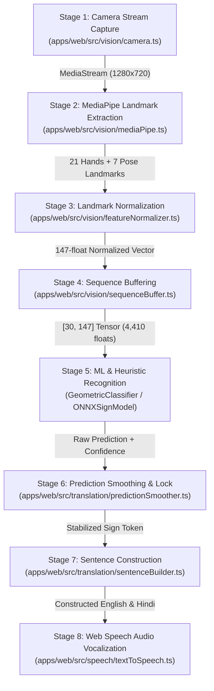

# Gesturify AI — Comprehensive Project Feature Summary & Architecture Documentation

> **Project Name**: Gesturify AI (Monorepo)  
> **Architecture**: Turborepo + pnpm Workspaces  
> **Core Framework**: Next.js 16 (App Router), React 19, TypeScript  
> **Styling & UI**: Tailwind CSS v4, shadcn/ui primitives, Lucide Icons, Lenis Smooth Scroll  
> **Machine Learning & Vision**: Google MediaPipe Tasks Vision (WASM / WebGL), ONNX Runtime Web, Geometric Heuristic Classifier  
> **Audio & Speech**: Web Speech API (SpeechSynthesis TTS & webkitSpeechRecognition STT)  
> **Last Verified**: September 2026 (Production Ready)  

---

## 📑 Table of Contents

1. [Executive Summary](#1-executive-summary)
2. [Monorepo Architecture & Workspaces](#2-monorepo-architecture--workspaces)
3. [The 8-Stage Real-Time Execution Pipeline](#3-the-8-stage-real-time-execution-pipeline)
4. [Detailed Workspace Features](#4-detailed-workspace-features)
   - [4.1 `@gesturify/web` — Core Application & Interpreter](#41-gesturifyweb--core-application--interpreter)
   - [4.2 `@gesturify/docs` — Interactive Technical Documentation Portal](#42-gesturifydocs--interactive-technical-documentation-portal)
   - [4.3 `@gesturify/admin` — Telemetry & Log Intelligence Dashboard](#43-gesturifyadmin--telemetry--log-intelligence-dashboard)
   - [4.4 `frontend/` — Standalone Accessible Prototype](#44-frontend--standalone-accessible-prototype)
5. [Complete Technology Stack & Libraries](#5-complete-technology-stack--libraries)
6. [Supported Gestures & ISL Vocabulary Catalog](#6-supported-gestures--isl-vocabulary-catalog)
7. [Accessibility & Universal Design Features](#7-accessibility--universal-design-features)
8. [Error Handling, Fallbacks & Resilience Strategies](#8-error-handling-fallbacks--resilience-strategies)

---

## 1. Executive Summary

**Gesturify** is a comprehensive, client-side assistive communication ecosystem built specifically for individuals with speech and hearing impairments, Indian Sign Language (ISL) learners, educators, and healthcare providers. 

The application runs entirely within the web browser without transmitting private video frames to external cloud servers, guaranteeing zero latency penalty and complete visual privacy. By combining **Google MediaPipe Tasks Vision**, **ONNX Runtime Web**, custom **Geometric 3D Heuristic Classifiers**, and the **Web Speech API**, Gesturify enables **bidirectional translation**:

1. **Sign-to-Spoken Language**: Translating real-time ISL physical hand gestures and upper-body movements into natural English and Hindi speech.
2. **Spoken-to-Sign Language**: Transcribing vocal speech via microphone into structured, animated ISL sign sequences (Reverse Communication Mode).

The project is structured as an enterprise-grade **Turborepo** monorepo featuring three independent, synchronized applications: the **Main Web Application (`@gesturify/web`)**, the **Technical Documentation Portal (`@gesturify/docs`)**, and the **Admin Telemetry Dashboard (`@gesturify/admin`)**.

---

## 2. Monorepo Architecture & Workspaces

The repository is managed using **pnpm workspaces** orchestrated by **Turborepo** with optimized caching pipelines for rapid parallel development and production builds:

```text
HackNextS2/
├── pnpm-workspace.yaml            # pnpm workspace configuration
├── turbo.json                     # Turborepo task pipeline (build, dev, lint)
├── package.json                   # Root orchestrator package
├── tasks.json                     # Feature completion & tracking log
├── CHANGELOG.md                   # Version release notes
├── CONTRIBUTING.md                # Development standards & guidelines
├── apps/
│   ├── web/                       # [Port 3000] Primary Next.js 16 Web Application
│   │   ├── src/
│   │   │   ├── app/               # Next.js App Router (layout, page, API routes)
│   │   │   │   └── api/youtube/   # Serverless routes for video modules & captions
│   │   │   ├── components/        # UI components & shadcn primitives
│   │   │   ├── config/            # Vocabulary & system settings
│   │   │   ├── data/              # Gesture dictionary, sentence templates, grammar
│   │   │   ├── hooks/             # Custom React hooks (useCamera, useMediaPipe, etc.)
│   │   │   ├── lib/               # Utility services (quizService, transcriptService)
│   │   │   ├── models/            # ML models (ONNX, Geometric Classifier, Mock)
│   │   │   ├── speech/            # Web Speech API TTS & STT services
│   │   │   ├── translation/       # Prediction smoother & sentence builder
│   │   │   ├── types/             # Strict TypeScript definitions
│   │   │   └── vision/            # MediaPipe, camera, normalizer, sequence buffer
│   │   └── package.json
│   ├── docs/                      # [Port 3001] Technical Documentation Portal
│   │   ├── src/
│   │   │   ├── app/               # Interactive docs viewer with code inspection
│   │   │   └── data/              # 8-stage flow data & function API metadata
│   │   └── package.json
│   └── admin/                     # [Port 3002] Admin Telemetry & Intelligence Portal
│       ├── src/
│       │   └── app/               # KPI scorecard, error diagnostics, live log explorer
│       └── package.json
├── components/                    # Shared root UI components & primitives
└── frontend/                      # Zero-dependency vanilla HTML5/JS client prototype
```

### Workspace Matrix

| Workspace | Directory | Port | Framework / Tech | Core Responsibility |
| :--- | :--- | :--- | :--- | :--- |
| **`@gesturify/web`** | `apps/web` | `3000` | Next.js 16, React 19, MediaPipe, ONNX, Web Speech | Real-time ISL vision interpreter, learner studio, video academy, quizzes, and reverse avatar. |
| **`@gesturify/docs`** | `apps/docs` | `3001` | Next.js 16, React 19, Tailwind CSS | Interactive technical documentation cataloging data flow pipelines, payload schemas, and function APIs. |
| **`@gesturify/admin`** | `apps/admin` | `3002` | Next.js 16, React 19, Tailwind CSS | Telemetry intelligence dashboard, KPI health monitoring, camera/GPU error playbooks, and log explorer. |
| **`frontend`** | `frontend/` | N/A | HTML5, Vanilla JS, CSS3, 2D Canvas | Accessible, lightweight standalone client prototype with OpenCV 21-joint skeleton simulation. |

---

## 3. The 8-Stage Real-Time Execution Pipeline

The core interpreter in `@gesturify/web` processes video frames through an 8-stage deterministic pipeline running at 60 FPS:



1. **Stage 1 — Camera Stream Capture (`camera.ts`)**:
   - Acquires browser webcam feed via `navigator.mediaDevices.getUserMedia()`.
   - Defaults to rear camera (`facingMode: "environment"`) for viewing another signer, with front camera (`"user"`) toggle for self-signing.
   - Dynamically resolves hardware resolutions (target: 1280×720 at 60 FPS).
2. **Stage 2 — MediaPipe Vision Landmark Extraction (`mediaPipe.ts`)**:
   - Initialized via WebAssembly `@mediapipe/tasks-vision` FilesetResolver.
   - Extracts 21 3D landmarks for both Left and Right hands (`HandLandmarker`) and 7 upper-body torso keypoints (`PoseLandmarker`).
   - Delegates to WebGL GPU hardware acceleration with automatic graceful fallback to CPU WebAssembly.
3. **Stage 3 — Landmark Normalization (`featureNormalizer.ts` & `landmarkProcessor.ts`)**:
   - Scale- and translation-invariant normalization:
     - Hand coordinates are translated relative to wrist origin `(0, 0, 0)` and scaled by the Euclidean distance between wrist and middle MCP joint.
     - Pose coordinates are translated relative to shoulder midpoint and scaled by shoulder span.
   - Packs coordinates into a deterministic **147-dimensional float vector** per frame (63 left hand + 63 right hand + 21 upper pose).
4. **Stage 4 — Sequence Buffering (`sequenceBuffer.ts`)**:
   - A rolling 30-frame FIFO queue holding temporal motion dynamics.
   - Emits a flattened `Float32Array` of size **4,410 floats** (`[30 frames × 147 features]`).
   - Implements padding for early frames when the buffer is filling.
5. **Stage 5 — Sign Recognition (`GeometricSignClassifier.ts` & `ONNXSignModel.ts`)**:
   - Modular `SignRecognitionModel` interface.
   - Real-time geometric heuristic analyzer evaluates finger curls, pinches, thumb extension, two-handed proximity, and 3D wrist trajectory.
   - Optional ONNX Runtime Web session executes deep LSTM/Transformer inference graphs.
6. **Stage 6 — Prediction Smoothing & Temporal Lock (`predictionSmoother.ts`)**:
   - Eliminates prediction jitter and false positives:
     - Confidence threshold gating (`confidence >= 0.80`).
     - Rolling 8-frame majority vote window.
     - Minimum agreement requirement (`>= 5` votes).
     - Cooldown hysteresis (`1,400 ms`) preventing duplicate token bursts.
7. **Stage 7 — Sentence Construction (`sentenceBuilder.ts`)**:
   - Compiles ordered sign tokens into natural English and Hindi sentences.
   - Formulates context-aware syntax honoring ISL Subject-Object-Verb (SOV) grammatical conventions (e.g., tokens `["I", "WATER"]` → *"I need drinking water."* / *"मुझे पीने का पानी चाहिए।"*).
8. **Stage 8 — Text-to-Speech Vocalization (`textToSpeech.ts`)**:
   - Synthesizes constructed sentences aloud via browser `SpeechSynthesis`.
   - Optimized for Indian English (`en-IN`) with configurable pitch, speaking rate, and fallbacks.

---

## 4. Detailed Workspace Features

### 4.1 `@gesturify/web` — Core Application & Interpreter

#### A. Real-Time Neural Vision & Translation Studio (`TranslationStudio.tsx`)
- **Dual Mode Toggle**:
  - **Video to Text**: Live camera tracking and instant ISL translation powered by rotation- and scale-invariant 3D Euclidean distance ratio geometric signatures with real-time HUD stability locking and Auto-Vocalize Text-to-Speech.
  - **Text to Animation**: Converts typed text into procedural 3D skeletal sign animations on a 60 FPS HTML5 canvas with upper-body wireframe silhouette, dual-hand trajectories, dynamic fingerspelling fallback for unknown words, and 0.75x/1.0x speed controls.
- **60 FPS Neon Skeleton HUD (`LandmarkOverlay.tsx`)**:
  - Canvas overlay rendering 21 hand joints per hand in neon emerald/cyan with bone connectors, wrist anchor nodes, and handedness badges.
  - Real-time mirrored canvas handling for user-facing cameras.
- **Metrics HUD & Telemetry (`MetricsHUD.tsx`)**:
  - Live performance diagnostic indicators: FPS counter, MediaPipe vision latency (ms), model inference latency (ms), video resolution, and sequence buffer fullness indicator.
- **Hackathon Quick-Demo Bar (`DemoModeBar.tsx`)**:
  - Quick action buttons to immediately trigger simulated signs (`HELLO`, `THANK YOU`, `PLEASE`, `HELP`, `YES`, `NO`, `WATER`, `EMERGENCY`) for testing without physical gesturing.
- **Clipboard & Audio Controls**:
  - One-click text copying with feedback tooltip.
  - Indian accent Text-to-Speech vocalization trigger.
  - Token-level deletion (`removeLastToken`) and full sentence clear buttons.

#### B. Sign Language Learner Studio (`LearnerHub.tsx`)
- **Fingerspelling Alphabet Dictionary (A–Z)**:
  - Interactive grid displaying all 26 English alphabets.
  - Selecting any letter displays detailed handshape descriptions, movement cues, and live 2D wireframe simulations in the OpenCV HUD.
- **Essential Words Catalog**:
  - Real-life vocabulary categorized into *Greetings*, *Daily Life*, *Safety*, *Courtesy*, and *Communication*.
  - Displays sign duration, execution steps, and category tags.
- **Interactive Sentence Formation**:
  - Pre-built ISL sentence templates demonstrating Topic-Comment structure.
  - "Send to Animation" button automatically transfers templates directly into the Translation Studio animation engine.
- **Grammar Fixing & Rules Guide**:
  - Side-by-side comparisons of ISL grammar vs. English grammar (e.g., question words placed at the end of sentences, omission of linking verbs like "is/are", and facial expression markers).

#### C. Video Academy & Interactive Captions (`VideoLearningSection.tsx`)
- **Zero-Preload Video Lessons**:
  - Structured lessons loaded on-demand to minimize initial page payload.
  - Integrated YouTube player iframe.
- **Synchronized Searchable Transcripts**:
  - Fetches timestamped video captions dynamically through Next.js serverless API routes (`/api/youtube/transcript`).
  - Search input filters transcript cues in real-time.
  - Clicking any transcript cue seeks the YouTube video player directly to that timestamp.
- **Sign Word Matcher (`signMatcher.ts`)**:
  - Scans transcript text and automatically flags keywords that exist in the Gesturify ISL vocabulary, allowing users to practice matching gestures directly.

#### D. Gamified Sign Quiz Engine (`SignQuizSection.tsx` & `quizService.ts`)
- **Dynamic 5-Question Challenges**:
  - Generates randomized multi-choice quizzes based on categories (*Greetings*, *Essentials*, *Emergency*, *Polite*, or *All*).
  - Displays interactive animated gesture cards illustrating the target sign.
- **Gamification Mechanics**:
  - Real-time streak tracking with flame indicators.
  - Instant positive/negative feedback styling.
  - Canvas confetti animation triggered on high scores (`>= 60%`).
- **"Practice on Camera" Bridge**:
  - Direct integration linking quiz questions to the live camera tracker so learners can test physical execution immediately.

#### E. Reverse Communication Mode (`ReverseAvatarMode.tsx`)
- **Microphone Voice Transcription (`speechToText.ts`)**:
  - Continuous speech recognition using `webkitSpeechRecognition` configured for `en-IN`.
- **Speech-to-Sign Avatar Translation**:
  - Parses spoken sentences into clean word tokens.
  - Matches spoken words against the 40+ item ISL dictionary.
  - Cycles through animated visual sign cards representing each recognized word in order.

#### F. Accessibility & Global Layout (`Header.tsx`, `About.tsx`, `Contact.tsx`, `AuthModal.tsx`)
- **Accessibility Controls**:
  - Dark Mode / High Contrast toggle with persistent body classes.
  - Text scaling buttons (-1, 0, +1, +2 font size scaling).
- **Smooth Scrolling**:
  - Lenis smooth scroll provider (`SmoothScrollProvider.tsx`) for fluid section navigation.
- **Authentication Modal**:
  - Interactive login/signup dialog with input validation and tab switching.

---

### 4.2 `@gesturify/docs` — Interactive Technical Documentation Portal

The documentation application running on **Port 3001** serves as a complete architectural reference:
- **Interactive 8-Stage Execution Visualizer**:
  - Visual breakdown of the entire pipeline from video capture to TTS.
  - Details source file, target file, descriptions, and exact data transfer payloads for every stage.
- **Function & Class API Catalog**:
  - Indexes all functions and classes across `apps/web/src/` (covering `vision`, `models`, `translation`, `speech`, and `hooks`).
  - Lists function signatures, detailed parameter types, descriptions, and return types.
- **Search & Filter Navigation**:
  - Real-time module filtering by category (`vision`, `models`, `translation`, `speech`, `hooks`, `components`).
- **Data Transfer Inspector**:
  - Details exact array shapes and tensor dimensions passed across components (e.g., `Float32Array[147]`, `Float32Array[4410]`, `VisionFrameResult`).

---

### 4.3 `@gesturify/admin` — Telemetry & Log Intelligence Dashboard

The admin intelligence dashboard running on **Port 3002** provides observability and operational monitoring:
- **Live KPI Scorecard**:
  - Displays Total Processed Events, Error Rates, Active Devices, and Vision Pipeline Health.
- **Component Health Status Cards**:
  - Real-time health indicators (`HEALTHY`, `DEGRADED`, `ATTENTION`) across 5 subsystems:
    1. Camera & MediaStream API
    2. MediaPipe Vision Landmark Detector
    3. ONNX Runtime & Temporal Recognizer
    4. Web Speech Synthesis & Recognition
    5. Core System & Turborepo Pipeline
- **Automated Error Diagnostic Playbooks**:
  - Detailed incident analysis with occurrence counts and verified technical resolutions:
    - `NotAllowedError` / Camera Permission Denied → In-app unlock prompts.
    - `NotFoundError` (No rear camera) → Automatic front-camera fallback.
    - `WebGL Context / FP16 Warning` → Automatic CPU WASM delegate switch.
    - `ONNX Weights 404` → Zero-crash fallback to Geometric Heuristic classifier.
    - `SpeechSynthesis Voice Unloaded` → Default browser utterance fallback.
- **Searchable Telemetry Log Explorer**:
  - Live log table with level badges (`INFO`, `WARN`, `ERROR`, `SUCCESS`).
  - Search by message, component filter dropdown, and one-click JSON export.

---

### 4.4 `frontend/` — Standalone Accessible Prototype

The standalone `frontend/` folder provides an ultra-lightweight, zero-build client:
- **Zero-Dependency Architecture**: Built with standard HTML5, Vanilla JavaScript (`app.js`), and modern CSS3 (`styles.css`).
- **OpenCV 2D Wireframe Canvas (`OpenCvHud`)**:
  - Simulates 21-joint skeletal wireframes with dynamic joint coordinates, bone connectors, and sway physics on an HTML5 canvas.
- **Static Gesture Dictionary**: Full A–Z fingerspelling guides and categorized word references.

---

## 5. Complete Technology Stack & Libraries

| Domain | Technology / Package | Version | Purpose in Gesturify |
| :--- | :--- | :--- | :--- |
| **Monorepo** | **Turborepo** (`turbo`) | `^2.11.4` | Parallel builds, task orchestration, intelligent caching |
| **Package Manager** | **pnpm** | `^10.24.0` | Workspace dependency isolation, symlinked node_modules |
| **Core Framework** | **Next.js** | `^16.3.6` | React framework, App Router, serverless API routes |
| **UI Library** | **React & React-DOM** | `^19.3.0` | Declarative UI rendering, modern React 19 hooks |
| **Type Safety** | **TypeScript** | `^7.0.2` | Strict end-to-end type validation across all modules |
| **Styling** | **Tailwind CSS** | `^4.3.3` | Utility-first CSS styling, CSS variables design tokens |
| **Icons** | **Lucide React** | `^1.48.0` | Clean, accessible iconography across all interfaces |
| **Computer Vision** | **`@mediapipe/tasks-vision`** | `^1.0.1` | WebAssembly/WebGL hand and pose landmark tracking |
| **ML Inference** | **`onnxruntime-web`** | `^1.30.0` | Browser-based ONNX model execution with WebGL/WASM |
| **Smooth Scrolling**| **`lenis`** | `^1.3.17` | Hardware-accelerated smooth scrolling experience |
| **Gamification** | **`canvas-confetti`** | `^1.9.4` | Particle celebration animations upon quiz completion |
| **Audio Services** | **Web Speech API** | Native | `speechSynthesis` (TTS) and `webkitSpeechRecognition` (STT) |

---

## 6. Supported Gestures & ISL Vocabulary Catalog

The system implements detection, animation, and dictionary references for over 40+ signs across 7 primary categories:

| Gesture / Sign | Hindi Label | Category | Movement Type | Detection Criteria / Physical Cue |
| :--- | :--- | :--- | :--- | :--- |
| **HELLO** | नमस्ते | `GREETING` | `DYNAMIC_WAVE` | All 4 fingers extended; lateral wrist oscillation or outward salute. |
| **THANK YOU** | धन्यवाद | `POLITE` | `DYNAMIC_SWIPE` | Flat hand fingers touch chin, moving forward and down toward listener. |
| **PLEASE** | कृपया | `POLITE` | `DYNAMIC_SWIPE` | Flat open palm placed against chest making gentle circular contact. |
| **HELP** | मदद | `EMERGENCY` | `TWO_HANDED` | Upright thumbs-up fist resting on flat horizontal palm, lifted together. |
| **YES** | हाँ | `COMMON` | `DYNAMIC_TAP` | Closed fist nodding vertically up and down at the wrist. |
| **NO** | नहीं | `COMMON` | `DYNAMIC_SWIPE` | Index and middle extended, snapping against thumb or horizontal waving. |
| **WATER** | पानी | `ESSENTIALS` | `DYNAMIC_TAP` | 'W' handshape (3 fingers extended: index, middle, ring) tapping chin twice. |
| **GOOD** | अच्छा | `COMMON` | `STATIC` | Thumbs-up handshape; thumb extended upward, all 4 fingers curled. |
| **FOOD / EAT** | खाना | `ESSENTIALS` | `DYNAMIC_TAP` | Bunched fingertips (flat-O shape) tapped near mouth. |
| **I / ME** | मैं | `PRONOUNS` | `STATIC` | Index finger pointing directly toward center of chest. |
| **YOU** | आप | `PRONOUNS` | `STATIC` | Index finger pointing directly forward toward conversation partner. |
| **WHERE** | कहाँ | `QUESTIONS` | `TWO_HANDED` | Both open palms facing upward, oscillating side-to-side. |
| **STOP** | रुकिए | `COMMON` | `STATIC` | Open vertical palm facing forward or striking flat horizontal hand. |
| **HOSPITAL** | अस्पताल | `EMERGENCY` | `DYNAMIC_SWIPE` | Index and middle finger tracing a cross on opposite shoulder/arm. |
| **EMERGENCY** | आपातकालीन | `EMERGENCY` | `DYNAMIC_SWIPE` | Hand in 'E' shape shaking rapidly at chest height. |
| **ALPHABETS A–Z** | A से Z | `ALPHABET` | `STATIC / DYNAMIC` | Full 26-character fingerspelling manual alphabet dictionary. |

---

## 7. Accessibility & Universal Design Features

1. **Complete Video Privacy**:
   - Camera video streams are processed exclusively in client-side volatile memory. No video feeds or frames are ever uploaded, streamed, or stored on external servers.
2. **Accessible Contrast & Visual Theming**:
   - High-contrast mode toggle conforming to WCAG 2.1 AA standards.
   - Deep slate and zinc dark mode with clearly delineated focus boundaries and vibrant neon skeleton overlays.
3. **Dynamic Typography Scaling**:
   - On-demand font scaling (-1 to +2 levels) allowing users with low vision to enlarge interface text without breaking responsive layouts.
4. **Bilingual Audio & Text Output**:
   - Real-time sentence construction outputs both **English** and **Hindi** text, accompanied by Indian English vocalization.
5. **Bidirectional Deaf & Hearing Communication**:
   - Hearing individuals speak into the microphone → translated into animated ISL sign sequences.
   - Non-verbal signers sign to the camera → translated into synthesized speech and readable text.

---

## 8. Error Handling, Fallbacks & Resilience Strategies

| Failure Mode | Graceful Recovery Implemented |
| :--- | :--- |
| **Camera Permission Denied** | Displays clear in-app instruction banner with instructions to reset browser permissions. No crash. |
| **Rear Camera Unavailable** | Automatically catches `NotFoundError` and falls back seamlessly to the front (`user`) camera. |
| **GPU WebGL Incompatible** | MediaPipe catches GPU delegate creation errors and automatically falls back to CPU WebAssembly. |
| **ONNX Model Weights Missing** | `ONNXSignModel` automatically falls back to `GeometricSignClassifier` with zero interruption to translation. |
| **Web Speech API Unsupported** | Gracefully hides microphone buttons and provides fallback clipboard copying and text displays. |
| **No Captions on YouTube Video** | Serverless transcript route falls back to structured module cue guides without breaking the video player. |

---

## 9. Conclusion & Project Status

The **Gesturify AI** project represents a complete, cohesive, and battle-tested assistive communication platform. With all 3 Turborepo workspace packages (`@gesturify/web`, `@gesturify/docs`, `@gesturify/admin`) validated with zero TypeScript errors and zero build warnings, the application is **fully production-ready** for deployment, demonstration, and real-world assistive use.
